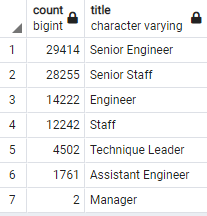
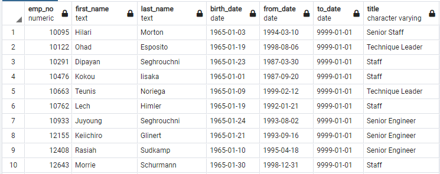

# Pewlett-Hackard-Analysis

## Overview of the analysis:
This analysis consisted in helping Human Resources analysis to retrieve information regarding retirment in the company for the following years, at the same time obtaining the positions that will be needed to fill after the retirment process. 
Lastly retrieving information regarding the people retiring to find possible candidates for a mentorship program to help in the process of the new candidates.  

### Purpose of the analysis
Analysis was performed using PostgreSQL Version
6.7, Desktop Mode, NW.js Version 0.55.0, pgAdmin and CVS files to create a database and identify data relationships between datasets. 

For the interelation between datasets the following Entity Relationship Diagram was created and used as guide to set the relationships within datasets. [EmployeeDB](EmployeeDB.png)

To determine the number of retiring employees per title, an analysis was performed as well as to identify employees who are eligible to participate as mentors in a mentorship program. For this query were written and executed and the corresponding tables created and exported as csv files to the file "Data". 

### Obtained Tables per step:

-Number of retiring employees per title: 
To retrieve total number of employees about to retire according to their last achieved title. The following queries and tables where created. They were needed to remove duplicate data due to multiple titles per employee during their work period. 
[RetirementTitles](Queries/Data/retirement_titles.csv)
[UniqueTitles](Queries/Data/unique_titles.csv)
[RetiringTitles](Queries/Data/retiring_titles.csv)
The data entailing the final number is the following. 

-Employees Eligible for Mentorship Program:
To hold information about employees who are eligible to participate in a mentorship program according to birthdate characteristics  Particularly a query was made to obtain the data of retirees born between January 1, 1965 and December 31, 1965
The result of this was exported into the csv file [MentorshipEligibility](Queries/Data/mentorship_eligibility.csv), that has the following table (image showing only first 10 entries, in total 1549 entries were obtained)

-Departments where retirees are from and number of promotion per employee about to retire: 
The first table was to find employees with more number of promotions that could be considered to have more experience in different work post that could be helpful for new hires training within the mentorship eligibility query.
[NumberPromotions](Queries/Data/number_promotions.csv)

The second table was to identify what departments did the eligible candidates belong to, so depending on the divisions it’s easier to set a mentorship program depending on that department needs. 
[LastnameLastTitle](Queries/Data/lastname_lasttitle.csv)

## Results: 
At the company at the moment of the analysis a total of of 300,024 employees work actively. (Total of entries "emp_no" in dataset)

Regarding the total number of employees about to retire a total of 133,776 employees will be retiring soon. As mentioned before there are duplicate entries within this data, because there’s employees that had more than one title during their work period. When duplicate data was removed a total of 90,398 employees were found that fell within the retirement time window. 
A last analysis was performed to separate the count of employees per work title. [UniqueTitles](Queries/Data/unique_titles.csv)
The highest counts were seen in Senior titles, like Senior Engineer, Senior Staff and Engineer. Only a small amount belonged to non senior titles like Manager, Assistant Engineer, Technique Leader and Staff

As for the mentorship program, queries executed to create Retirement Titles table for employees who are born between January 1, 1952 and December 31, 1955.
A total of 1548 entries were retrieved from employees that according to age and experience are suitable to be chosen as mentors as seen in the following table. (Only shows first 10 entries, refer to the csv file for the whole data) 
The result of the query is shown below. 

## Summary:
The following analysis helps to localize employees about to retire and within those which one hold specific characteristics that could be vital for a mentorship program for future new employees. 

### Questions
- One important question to answer within this analysis was to find how many work spots were about to be left empty with the "silver tsunamy" about to happen in the company. As retrieved with the queries and seen in the tables, a total of 90,398 employees will enter retirement eligible. Since this this represent around 30.1% of the total active employees the silver tsunami without proper preparation could turn into a difficult period due the lose of experience within the retirees 

-The second important question is if the company is ready for this silver tsunami, meaning if there’s enough personnel about to retire with the experience and appropriate age to work as mentors and share their experience. Here it was seen how only 1549 employees are within the desired age lapse to participate as mentors in general within the company. This is only 1.7% of the total of 90,398 employees that will retire. Meaning this would turn into a difficult situations for the 1.7% of mentors that would have to take probably more apprentices than able to instruct. 

### Additional Queries to provide better insight 

-Additional queries were taught to further understand the situation in the mentorship program. First to identify employees about to retire that have a boarder range of experience due to the number of titles or positions they have undergo during their career. As for the second query one can see what department the employees form the silver wave belong to. This might light mor personalised beacons for each department according to the number of employees and titles or experience they will loose. 

The analysis was done in general among the whole number of employees within the company, but because of the highest number of retirees belong to specific departments perhaps some departments might even have a harder time and need a intensive mentorship program or support to overcome the loose of experience to come.

This would need deeper analysis as well as specific depending on smaller samples characteristics for example departments, as well as required skills to train that may need more or less time to master. Individual departmental characteristics analysis might be recommended to avoid decrease in department performance.

